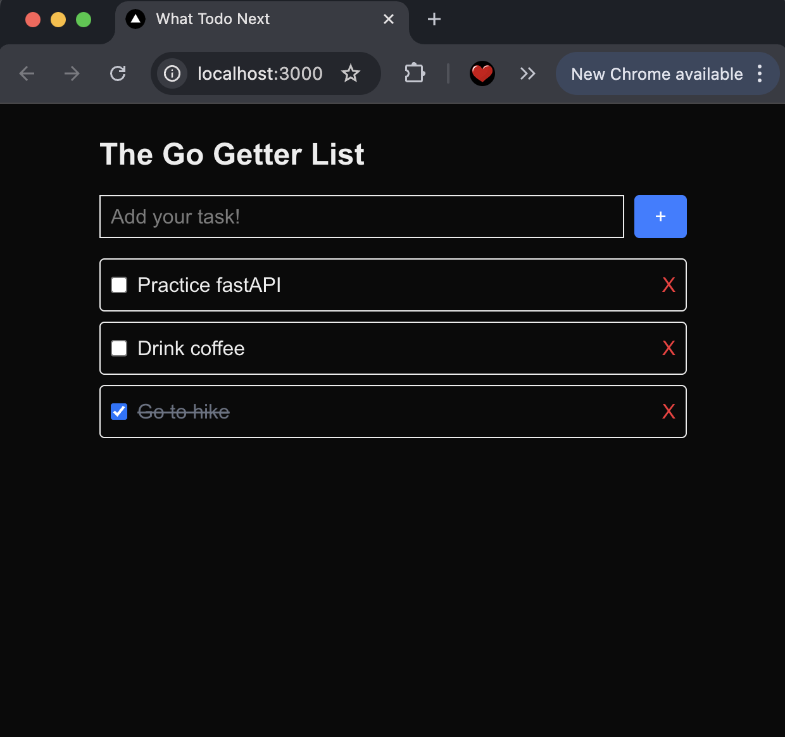

# What Todo Next
(Next.js + FastAPI + PostgreSQL)



A full-stack To-Do application for **Go Getters** built with:

- **Frontend**: [Next.js 15](https://nextjs.org/) + Tailwind CSS  
- **Backend**: [FastAPI](https://fastapi.tiangolo.com/)  
- **Database**: PostgreSQL  

This project is designed as a practice exercise to understand **CRUD**, **API ↔ DB ↔ Frontend flow**, and **basic full-stack app setup**.

---

## Features
- Add new tasks
- Mark tasks as completed
- Delete tasks
- Backend API documented with **Swagger UI**
- Simple responsive UI with Tailwind

---

## Project Structure
```
todo/
│── backend/              # FastAPI backend
│   ├── main.py           # API server
│   └── venv/             # Python virtual environment (optional)
│
│── frontend/             # Next.js frontend
│   ├── src/app/page.tsx  # Main To-Do page
│   └── ...
│
└── README.md
```

---

## ⚙Setup Instructions

### 1. Clone Repository
```bash
git clone https://github.com/yourusername/todo.git
cd todo
```

---

### 2. Database (PostgreSQL)
Run PostgreSQL locally or via Docker:

```bash
docker run --name todo-db   -e POSTGRES_USER=todo   -e POSTGRES_PASSWORD=1234   -e POSTGRES_DB=todo   -p 5432:5432 -d postgres
```

Create `todos` table:

```sql
CREATE TABLE todos (
  id SERIAL PRIMARY KEY,
  title TEXT NOT NULL,
  completed BOOLEAN DEFAULT FALSE,
  created_at TIMESTAMP DEFAULT CURRENT_TIMESTAMP
);
```

---

### 3. Backend (FastAPI)
```bash
cd backend
python -m venv venv
source venv/bin/activate   # Mac/Linux
venv\Scripts\activate      # Windows

pip install fastapi uvicorn psycopg2-binary
uvicorn main:app --reload
```

Server URL: [http://localhost:8000](http://localhost:8000)  
Interactive API docs: [http://localhost:8000/docs](http://localhost:8000/docs)

---

### 4. Frontend (Next.js)
```bash
cd frontend
npm install
npm run dev
```

App runs: [http://localhost:3000](http://localhost:3000)

---

## API Endpoints
- `GET /todos` → List all todos
- `POST /todos` → Create new todo
- `PUT /todos/{id}` → Update todo (toggle completed, edit title)
- `DELETE /todos/{id}` → Delete todo

---

## Notes
- For development, CORS is open (`*`) so frontend ↔ backend works easily.  
- In production, restrict `allow_origins` in FastAPI to your frontend domain.  
- This is a **practice project** — not optimized for production use.
